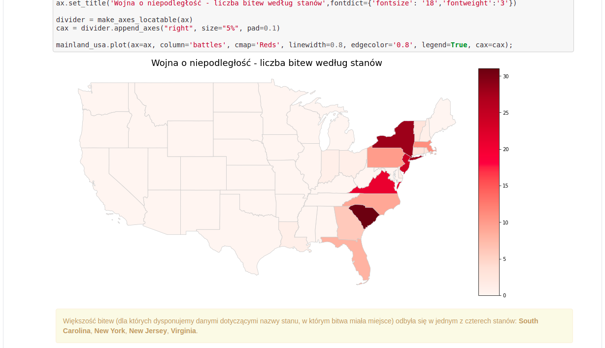
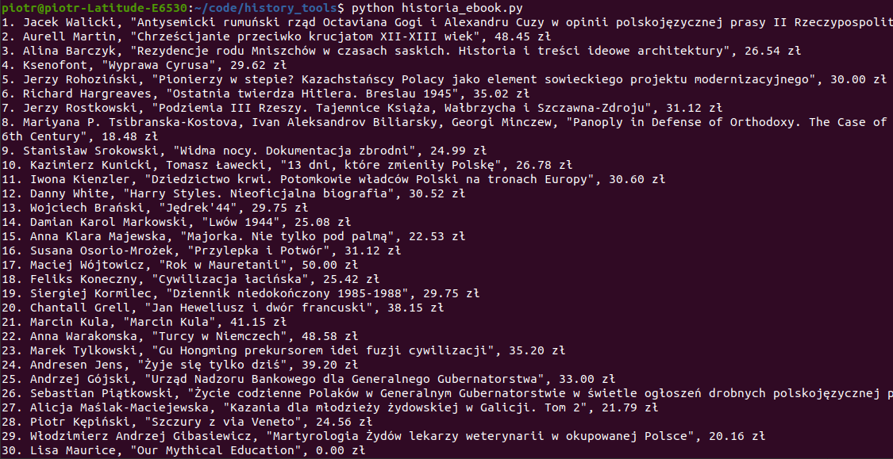

# history_tools
Różne skrypty i programy

- battles.ipynb - notebook z prostą analizą danych starć podczas wojny o niepodległość
  Stanów Zjednoczonych na podstawie danych z lokalizacją bitwy, datą początku i nazwą stanu.

  

- historia_ebook.py - skrypt pobiera ze strony księgarni ebookpoint.pl dane najnowszych
  ebooków z działu historia i wyświetla w formie listy: lp, autor, tytuł, cena.

  